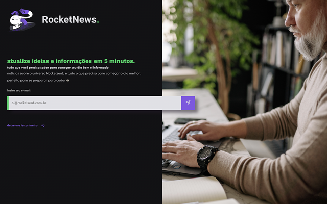

<h4 align="center"> 
	🚧 Rocket News 🚀
</h4>

<p align="center" style="display: flex; align-items: flex-start; justify-content: center;">
  
</p>  

### 💻 Sobre o desafio

Desenvolva uma página web simples utilizando HTML e CSS que servirá no futuro para captação de leads ou inscrição em newsletter.

#### 💻 Techs

- Nível de dificuldade: Iniciante
- Tecnologias: html, css

#### 💻 Como começar?

1 - Use o link do [Figma](https://www.figma.com/file/IUmw9V5WLJRxYRbiRnE4KG/DD-%2F-RocketNews-(Copy)?node-id=3%3A2) como base para o projeto. Também disponibilizamos para download todos os assets necessários (imagens e ícones), para fazer o download basta clicar no link acima.  

2 - Leia com atenção todas as instruções do desafio.

3 - Bora codar! Lembre-se que você pode usar as tecnologias que se sentir mais confortável, mas também pode se desafiar usando novas techs, fazendo modificações e/ou adicionando funcionalidades no projeto como preferir. 🚀

4 - Compartilhe seu resultado ou tire suas dúvidas na nossa [**comunidade aberta**](https://discord.gg/bacwY2gDCF)

### 💡 Conteúdos Aplicados

Neste desafio você vai construir uma página para a captação de leads ou newsletter. Caso você ainda não tenha feito os cursos do Discover ou queira fazer uma revisão, segue abaixo uma lista dos cursos que podem te ajudar a resolver este desafio.

#### 💡 [Guia Estelar de HTML](https://app.rocketseat.com.br/discover/course/o-guia-estelar-de-html)
O conteúdo esclarece plugin de preview HTML, tags, atributos, semântica, listas, abreviações, listas, representação de código, URLs, diretórios, tabelas, THead, TBody, colgroup, cabeçalho, meta, favicon, meta SEO e meta social.

#### 💡 [Guia Estelar de CSS](https://app.rocketseat.com.br/discover/course/o-guia-estelar-de-css)
O conteúdo aborda anatomia, seletores, box model, cascata, especificidade, shorthand, funções, devTools e vender prefixes.

#### 💡 [Posicionamento foguetes](https://app.rocketseat.com.br/discover/course/posicionando-foguetes)
Conhecer como o CSS trabalha com layout ou o posicionamento dos elementos na sua página, é essencial.

#### 💡 [Formulários de outro planeta](https://app.rocketseat.com.br/discover/course/formularios-de-outro-planeta)
A tag form no HTML é a maneira mais tradicional de interagir com o usuário da aplicação e é incrível o que é possível com esse elemento.

### 🚀 [Requisitos do projeto](https://efficient-sloth-d85.notion.site/Desafio-RocketNews-2e2c5d56b41f4b13a7d8df6b5affc0ec)

#### 🚀 Requisitos para o desafio 

- [ ] Criar uma página que contenha um formulário para que o usuário possa inserir o e-mail.
- [ ] Ter um botão para o usuário clicar após inserir o e-mail.

#### 🚀 Requisitos bônus 

- [ ] Criando uma função para o botão (ex. Exibir um alerta)
- [ ] Salvar os e-mails digitados em algum banco de dados

### 🎨 Style Guide

#### 🎨 Cores

- Templates de referências para ser feito

<p align="center" style="display: flex; align-items: flex-start; justify-content: center;">
  
</p>  

````css
:root {
  --body-bg-color: #121214;
  --text-color: #E1E1E6;
  --title-color: #04D361;
  --form-color: #A8A8A8;
  --bg-button-color: #8257e5;
}
````

#### 🎨 Fontes

- [x] font-family: Spartan, Work Sans  
- [x] font-weight: 400, 500, 700
- [x] Você pode encontrar a fonte no [Google Fonts](https://fonts.google.com/)

### 📅 Entrega

Após concluí-los, adicionar esses códigos ao seu Github é uma boa forma de demonstrar seus conhecimentos para oportunidades futuras.

#### 📅 Tarefas

- [x] Organizando os detalhes do projeto no readme.md
- [x] Uma branch main e uma developer
- [x] Favicon
- [x] [Learn Responsive Design](https://web.dev/learn/design/)
- [x] [Learn CSS](https://web.dev/learn/css/)
- [ ] Dimensões dos elementos em Telas
- [ ] Responsividade

#### 📅 Telas

- Desktop

<p align="center" style="display: flex; align-items: flex-start; justify-content: center;">
  
</p>  

- Mobile

<p align="center" style="display: flex; align-items: flex-start; justify-content: center;">
  
</p>  

Feito com ❤️ por Douglas A B Novato. 👋🏽 [Entre em contato!](https://www.linkedin.com/in/douglasabnovato/)
 
Fonte do projeto na [Rocketseat](https://www.rocketseat.com.br/). 👋 Participe da [comunidade aberta](https://discord.gg/bacwY2gDCF)!
